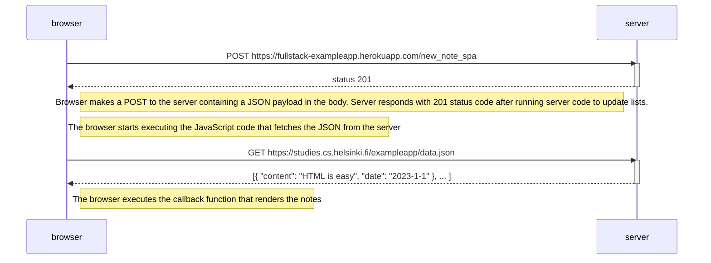

```mermaid
sequenceDiagram
    participant browser
    participant server

    browser->>server: POST https://fullstack-exampleapp.herokuapp.com/new_note_spa
    activate server
    server-->>browser: status 201
    deactivate server

    Note left of server: Browser makes a POST to the server containing a JSON payload in the body.   Server responds with 201 status code after running server code to update lists.

    Note right of browser: The browser starts executing the JavaScript code that fetches the JSON from the server

    browser->>server: GET https://studies.cs.helsinki.fi/exampleapp/data.json
    activate server
    server-->>browser: [{ "content": "HTML is easy", "date": "2023-1-1" }, ... ]
    deactivate server

    Note right of browser: The browser executes the callback function that renders the notes
```
